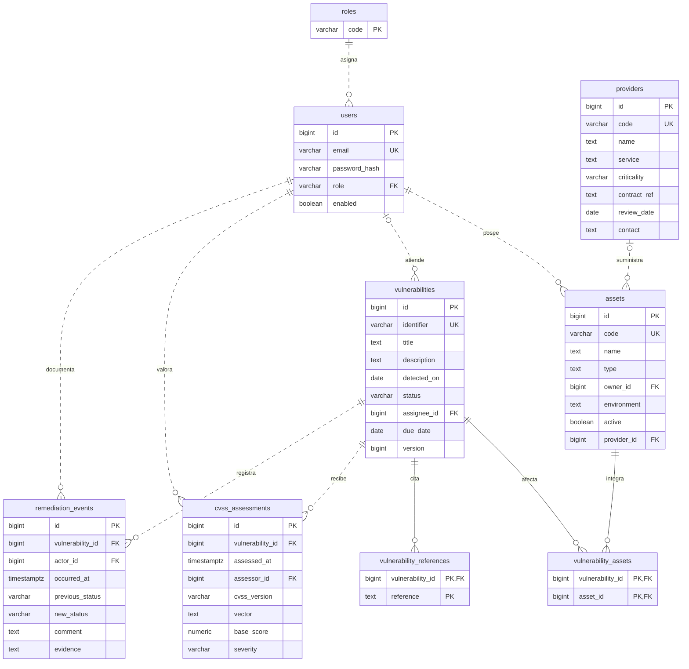

```mermaid
erDiagram
    roles ||..o{ users : asigna
    providers o|..o{ assets : suministra
    users ||..o{ assets : posee
    users o|..o{ vulnerabilities : atiende
    vulnerabilities ||--o{ vulnerability_assets : afecta
    assets ||--o{ vulnerability_assets : integra
    vulnerabilities ||--o{ vulnerability_references : cita
    vulnerabilities ||..o{ cvss_assessments : recibe
    users ||..o{ cvss_assessments : valora
    vulnerabilities ||..o{ remediation_events : registra
    users ||..o{ remediation_events : documenta

    roles {
        varchar code PK
    }
    users {
        bigint id PK
        varchar email UK
        varchar password_hash
        varchar role FK
        boolean enabled
    }
    providers {
        bigint id PK
        varchar code UK
        text name
        text service
        varchar criticality
        text contract_ref
        date review_date
        text contact
    }
    assets {
        bigint id PK
        varchar code UK
        text name
        text type
        bigint owner_id FK
        text environment
        boolean active
        bigint provider_id FK
    }
    vulnerabilities {
        bigint id PK
        varchar identifier UK
        text title
        text description
        date detected_on
        varchar status
        bigint assignee_id FK
        date due_date
        bigint version
    }
    vulnerability_assets {
        bigint vulnerability_id PK, FK
        bigint asset_id PK, FK
    }
    vulnerability_references {
        bigint vulnerability_id PK, FK
        text reference PK
    }
    cvss_assessments {
        bigint id PK
        bigint vulnerability_id FK
        timestamptz assessed_at
        bigint assessor_id FK
        varchar cvss_version
        text vector
        numeric base_score
        varchar severity
    }
    remediation_events {
        bigint id PK
        bigint vulnerability_id FK
        bigint actor_id FK
        timestamptz occurred_at
        varchar previous_status
        varchar new_status
        text comment
        text evidence
    }
```
